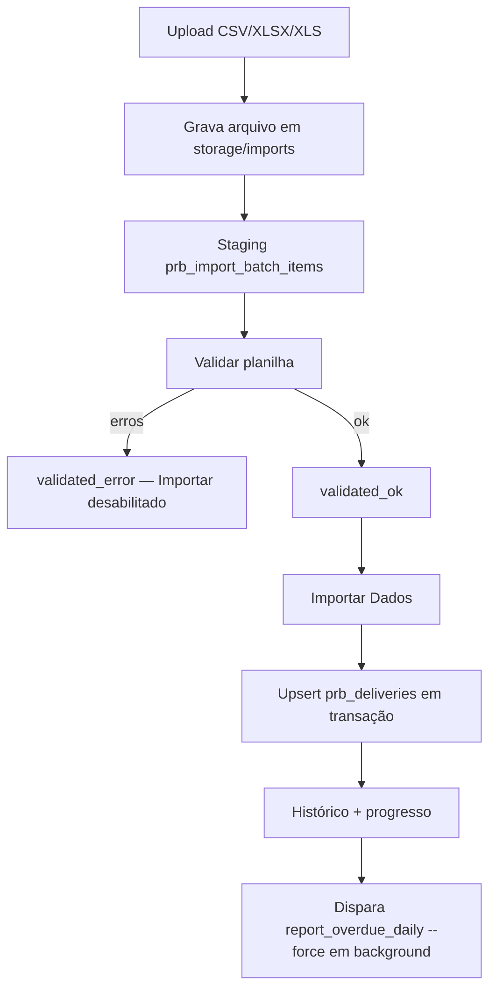

# Importação manual de planilhas

## Objetivo

Permitir que administradores atualizem `prb_deliveries` via planilha (CSV/Excel),
como alternativa à API TMS Elite, com validação prévia e histórico auditável.

## Fluxo



## Acesso

- Somente perfil **admin**
- Menu: **Administração → Importação de Dados**

## Formatos e limites

- `.csv`, `.xlsx`, `.xls`
- Layout compatível com `dados/entregas_relatorio.csv` / `COLUNAS_UTEIS` em `limpeza.py`
- Máximo **20 MB** e **100.000** linhas
- Arquivos retidos em `storage/imports/` (sem purge automático)

## Validação

- Sem escrita em `prb_deliveries` até confirmação
- Estrutura: colunas obrigatórias (`Nro. Entrega`, `Sigla Unidade Entrega`, `Nome Pessoa Visita`) e cabeçalhos duplicados bloqueiam o upload
- Colunas extras do export operacional (fora de `COLUNAS_UTEIS`) são ignoradas — o layout real tem ~80+ campos
- Filial obrigatória e existente em `prb_users` (`profile=filial`, `enabled`)
- Erro de filial sugere cadastro em **Administração → Usuários**
- Duplicidade de `nro_entrega` na planilha, datas/valores inválidos, obrigatórios vazios
- Política **all-or-nothing**: qualquer erro bloqueia a importação

## Importação

- Upsert por `remessa_numero` (mesmo contrato da API/CSV)
- Source: `manual_upload`
- Transação única no lote; falha ⇒ rollback das entregas do lote

## Relatórios após importação (Alternativa 1)

Reutiliza o job existente:

```bash
python -m worker run report_overdue_daily --force
```

Disparo em background após `imported` (não bloqueia a API). `--force` ignora a janela `--if-due`.
Falha no disparo é registrada em `report_job_*` do batch sem desfazer o upsert.

## Tabelas

| Tabela | Uso |
|--------|-----|
| `prb_import_batches` | Lote, progresso, contadores, histórico |
| `prb_import_batch_items` | Staging por linha |
| `prb_import_logs` | Erros de validação |
| `*_audit` | Auditoria |

## API

| Método | Path | Descrição |
|--------|------|-----------|
| POST | `/api/imports/upload` | Upload multipart |
| POST | `/api/imports/{id}/validate` | Validação |
| POST | `/api/imports/{id}/import` | Inicia importação |
| GET | `/api/imports/{id}` | Status/progresso |
| GET | `/api/imports` | Histórico (`enabled=true`) |
| GET | `/api/imports/{id}/errors` | Lista de erros |
| DELETE | `/api/imports/{id}` | Exclusão lógica (só `validated_error` / `failed`) |
| POST | `/api/imports/{id}/deactivate` | Exclusão lógica (alias) |

## Cache do arquivo

- Em **sucesso** (`imported`) ou **falha** (`validated_error` / `failed`), o arquivo em `storage/imports/` é removido.
- Após erro, apenas as mensagens permanecem na tela; nova tentativa exige **novo upload**.
- Lotes com erro podem ser removidos do grid via exclusão lógica (`enabled=false`).
