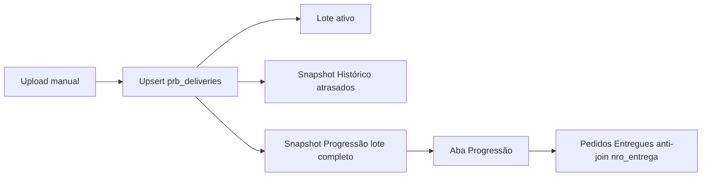

# Progressão de pedidos e Clientes — guia curto

## Fluxo upload → snapshot → Progressão

## Uso rápido

- **Filtro Status** (Operacional/Histórico/Progressão): vazio = padrão atual; com seleção, recalcula só esses status.
- **Clientes** (Admin → Clientes): Nome, CNPJ, e-mails (vírgula). Seed: `python database/deploy/seed_clients_from_csv.py` (ver `docs/clientes.md`).
- **Relatório cliente**: automação `report_client_daily` / fase no job de e-mails; match `prb_clients.cnpj` = `prb_deliveries.cnpj_cliente`.
- **Progressão**: nova aba no BI; gráfico por **STATUS PRAZO** (calcConsolidada: `01_ATRASO`…`05_VENCIMENTO FUTURO`); precisa de ≥2 uploads no período; Pedidos Entregues = número presente no upload anterior e ausente no atual; **Pedidos consolidados** = união de `nro_entrega` no período (sem duplicar entre uploads).
- **Captura:** após upload manual, aplica macros (exclui `ENTREGUE`) e grava `status_prazo` no snapshot.
- **Demo local (semana seg→sex):** `.\.venv\Scripts\python.exe database/deploy/seed_progress_snapshot_demo.py --replace`
- **Histórico antigo:** uploads manuais anteriores à entrega da Progressão **não** entram no cálculo — só snapshots gerados a partir de novos uploads manuais bem-sucedidos.
